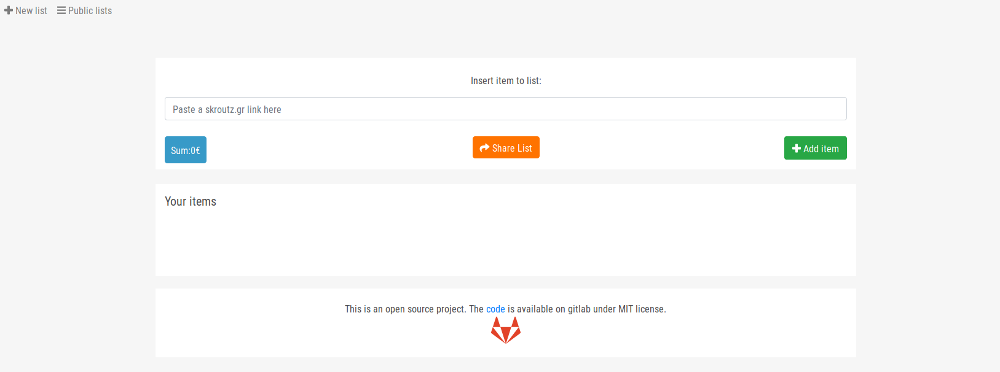
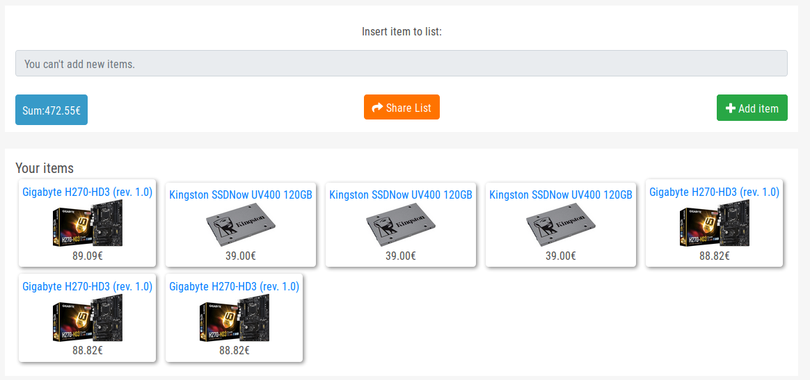

<h4>Unofficial skroutz.gr basket</h4>
This a custom basket for skroutz.gr
 
The official basket allows you to collect items only from some special categories.  
You can collect items, create and share list with your friends. 
 
In the total price the shipping is not included.
 
Use with your own risk.

You can check the site here. BUT! 
It is hosted on a free host provider so there are some limitation.  
For example, python can't interact with skroutz directly so I use a proxy for the requests. 
Because of proxy, there is a dalay, sometimes proxy is down...
http://gruber.ga/  

<h4>TODO:</h4>
<ol>
	<li>Better CSS for items</li>
	<li>Calculate shipping</li>
	<li>API endpoints with DRF for ajax communications</li>
	<li>Sanitize inputs</li>
	<li>Optimize javascript</li>
</ol>